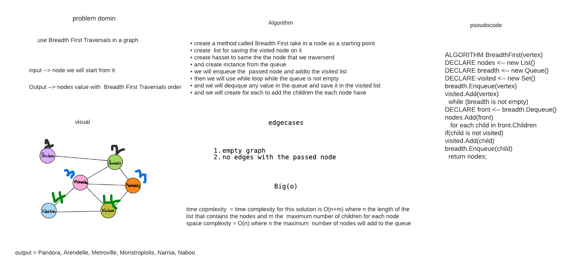

# Breadth-First Traversal of a Graph
### The breadth-first traversal of a graph is like that of a tree, with the exception that graphs can have cycles. Traversing a graph that has cycles will result in an infinite loop
<!-- Short summary or background information -->

## Challenge
### we need to use breadth-first concept to traversal in the graph and print the values
<!-- Description of the challenge -->

## Approach & Efficiency

## what i used to solve this code challenge is using queue implementation to save values and print it the time complexity for this solution is O(n+m) where n the length of the list that contains the nodes and m the  maximum number of children for each node

<!-- What approach did you take? Why? What is the Big O space/time for this approach? -->

## Solution

<!-- Embedded whiteboard image -->
