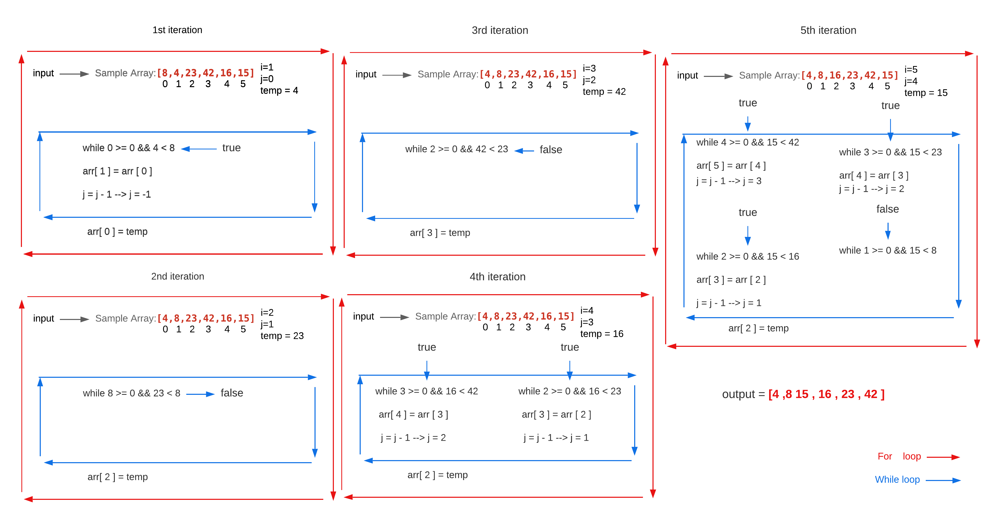

# Insertion Sort
### Insertion sort is a simple sorting algorithm that works similar to the way you sort playing cards in your hands. The array is virtually split into a sorted and an unsorted part. Values from the unsorted part are picked and placed at the correct position in the sorted part.
## Pseudocode

      InsertionSort(int[] arr)
      FOR i = 1 to arr.length

      int j <-- i - 1
      int temp <-- arr[i]

      WHILE j >= 0 AND temp < arr[j]
        arr[j + 1] <-- arr[j]
        j <-- j - 1

      arr[j + 1] <-- temp

## Trace

### Sample Array: [8,4,23,42,16,15]

#### In each iteration we are checking the element of the index i if is less than the element of index j and switching the numbers.
### Efficiency
* ####  Time: O(n^2) : because we are using while loop inside the for loop.
* ####  Space: O(1).

