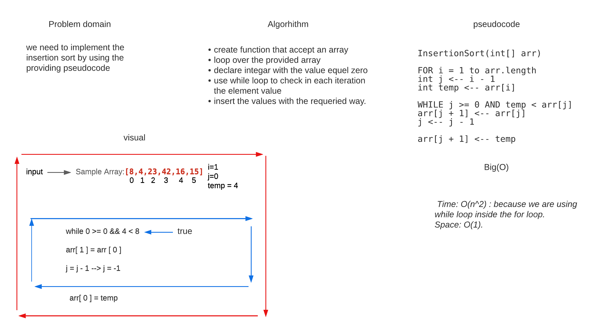

# Challenge Summary
#### In this code challenge we will use insertion sort to sort array, and we will explain what is happening in each iteration

## Whiteboard Process

## Approach & Efficiency
* ####  Time: O(n^2) : because we are using while loop inside the for loop.
* ####  Space: O(1).

## Solution
#### To run this code just you need to add your array in the App.java file and in will be sorted.
