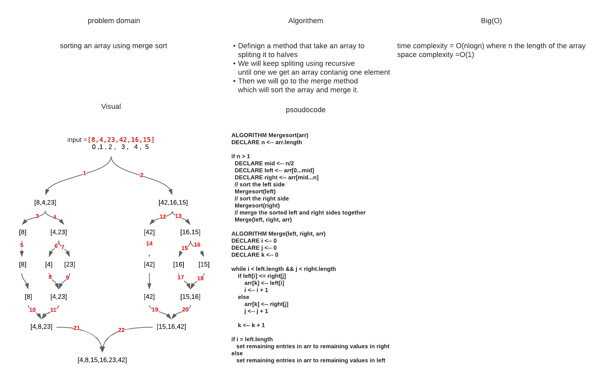

# Challenge Summary
Merge Sort is a Divide and Conquer algorithm. It divides the input array into two halves, calls itself for the two halves, and then merges the two sorted halves.
## Whiteboard Process

## Approach & Efficiency
### Time complexity O(n log n) : where n is the length of the array

### Space complexity O(1)

## Solution
### To run this code just you need to provide the array that you want to apply to merge sort on it in the app class
