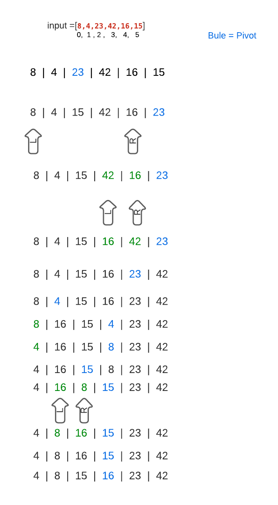

# Quick Sort
## QuickSort is a Divide and Conquer algorithm. It picks an element as pivot and partitions the given array around the picked pivot

 ## Pseudocode

    ALGORITHM QuickSort(arr, left, right)
    if left < right
    // Partition the array by setting the position of the pivot value
    DEFINE position <-- Partition(arr, left, right)
    // Sort the left
    QuickSort(arr, left, position - 1)
    // Sort the right
    QuickSort(arr, position + 1, right)

    ALGORITHM Partition(arr, left, right)
    // set a pivot value as a point of reference
    DEFINE pivot <-- arr[right]
    // create a variable to track the largest index of numbers lower than the defined pivot
    DEFINE low <-- left - 1
    for i <- left to right do
    if arr[i] <= pivot
    low++
    Swap(arr, i, low)

     // place the value of the pivot location in the middle.
     // all numbers smaller than the pivot are on the left, larger on the right.
     Swap(arr, right, low + 1)
    // return the pivot index point
     return low + 1

    ALGORITHM Swap(arr, i, low)
    DEFINE temp;
    temp <-- arr[i]
    arr[i] <-- arr[low]
    arr[low] <-- temp

## Trace

### 1. we will select the pivot which is 23 in this solution  and move it the end
### 2. Then we will look for numbers in the left and right less and larger than the pivot and start swiping them to the correct position
### 3. keep using recursion and applying this process until we get sorted array.

## Big (O)

### With using the recursion and splitting the array to a halves every time, so the time  and space complexity will be O(nLog n)

