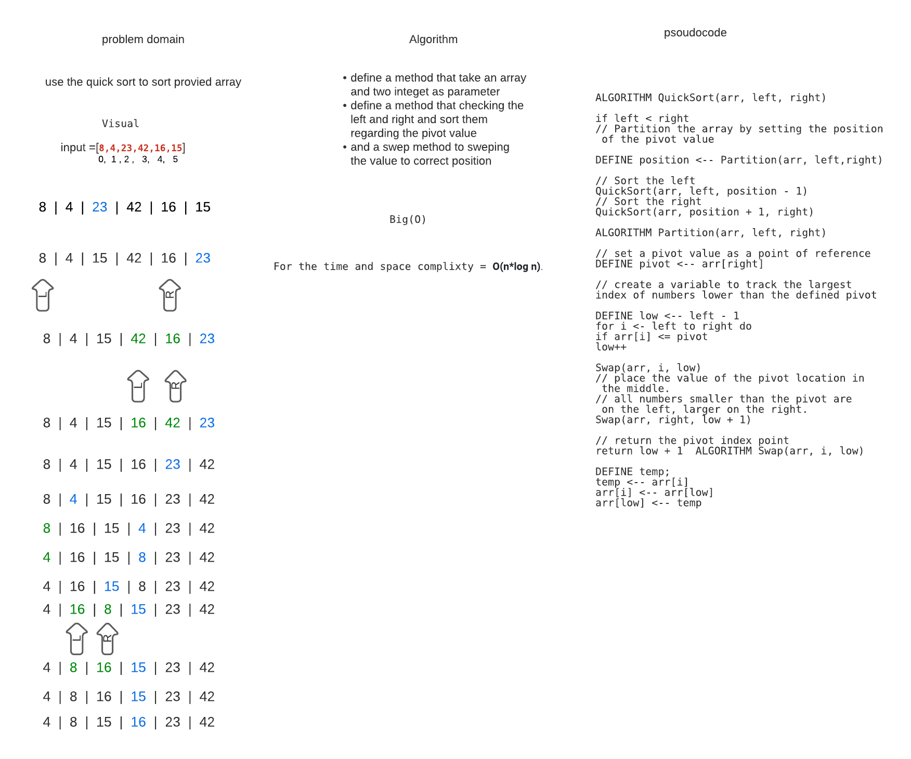

# Challenge Summary
### QuickSort is a Divide and Conquer algorithm. It picks an element as pivot and partitions the given array around the picked pivot
<!-- Description of the challenge -->

## Whiteboard Process

## Approach & Efficiency
### With using the recursion and splitting the array to a halves every time, so the time  and space complexity will be O(nLog n)

## Solution
### To run your app you need to add your array in the app class
