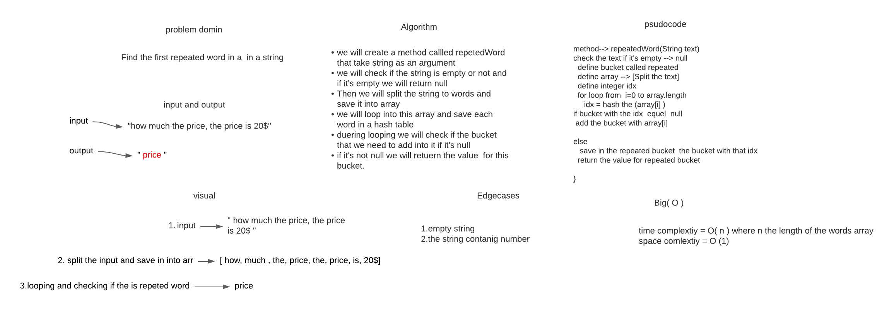

# Challenge Summary
### We have a string that contain sentance, and we need to find the first repeated word in this string
## Whiteboard Process

## Approach & Efficiency
### What I did is use the hash table to find the repeated value with using a for loop and split method
#### time complexity : O(n)
#### space complexity : O(1)

## Solution
### to use this algorithm just you need add your text in the repeatedWord method.
#### examples:

#### input : "Once upon a time, there was a brave princess who" --> output : "a"
#### input : "It was the best of times, it was the worst of times, it was the age of wisdom," --> output : "it"
#### input : "It was a queer, sultry summer, the summer they electrocuted the Rosenbergs" --> output : "summer"

