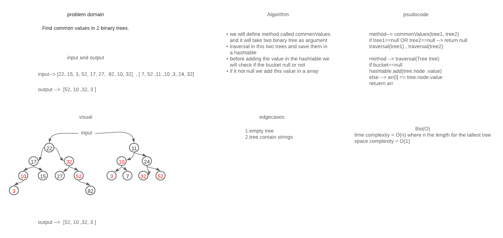

# Challenge Summary
### Given two Binary Search Trees, find common values in them. In other words, find intersection of two binary tree.
## Whiteboard Process

## Approach & Efficiency
### What i did in the code challenge is using the  BTS implementation  to save my values into it and hashtable to find the common value and return array of this values
## Solution
### to run this app you need add your values in  the first tree, and the second tree in the app class.
#### example
##### Input tree one: 1 ,5 ,7, 9, 11
##### Input tree two: 2, 5, 6, 9, 10
##### output : 5,9
