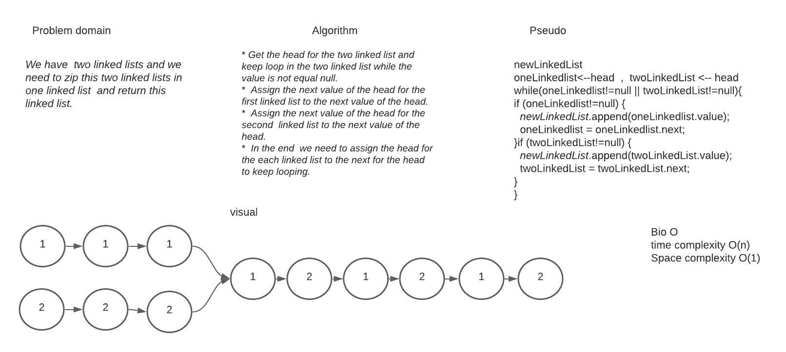

# Zip two linked lists

### Challenge Summary
#### In this code challenge it's required to marge two array together by zipping between two value.

### Challenge Description
#### We have  two linked lists and we need to zip this two linked lists in one linked list  and return this linked list.
### Approach & Efficiency

* ##### Get the head for the two linked list and keep loop in the two linked list while the  value is not equal null.
* ##### Assign the next value of the head for the first linked list to the next value of the head.
* ##### Assign the next value of the head for the second  linked list to the next value of the head.
* ##### In the end  we need to assign the head for the each linked list to the next for the head to keep looping.

### Solution

<!-- Embedded whiteboard image -->

