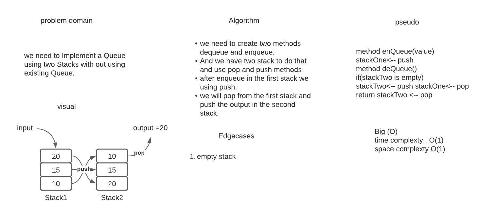

# Stacks and Queues
### *code challenge 10*
## In this code challenge we  learned how to deal with Stacks and Queues and it's very important to know it.
## Challenge
## It was required to create tow class  for the stack, queues and for node.
# Approach & Efficiency
## After I created the class I start deal with code as following:
### A) `Stack class :`
* #### `push`: To create new node and push it in the stack.
* #### `pop`: When  Nodes or items that are removed from the stack are popped.
* #### `peek`: This method will view the value of the top Node in the stack.
* #### `isEmpty`: This method returns true when stack is empty otherwise returns false.
### B) `Queues class:`
* #### `enqueue:` This method to  add Nodes or items to the queue.
* #### `dequeue:`This method to remove Nodes or items  from the queue.
* #### `peek:`This method will view the value of the front Node in the queue.
* #### `isEmpty:` This method returns true when queue is empty otherwise returns false.

### *code challenge 11*
## Challenge Description
### In this code challenge it was required to Implement a Queue using two Stacks.

## Approach & Efficiency
### we used the pop and push methods in the stack to deal with enqueue and dequeue the time and space  complexity is  O(1)

## solution

