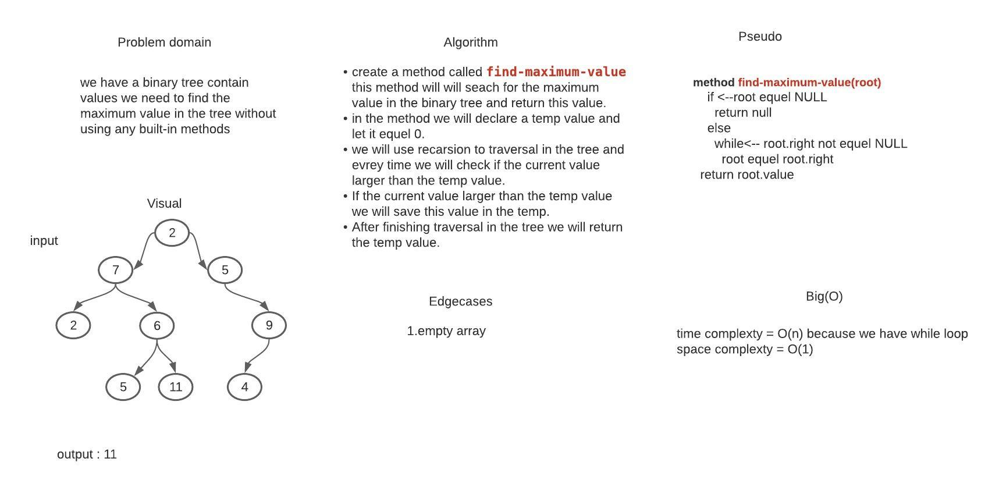

# Trees

### Trees is a type of data structure and  we have many types of tree in this code challenge we are dealing with binary tree.

## Challenge

### In this challenge what is required is learn how we can traversal in a tree and adding elements.

## Approach & Efficiency

### In this  code challenge most method using recursion the Big(O) for the time is O(log n).

## API

### Here is description for each method in this code challenge :

* #### `preOrder:` to traversal in the tree by following this approach *root >> left >> right*
* #### `inOrder:`to traversal in the tree by following this approach *left >> root >> right*
* #### `postOrder:`to traversal in the tree by following this approach *left >> right >> root*
* #### `add:` this method to add take integer as  input and add it in the correct location in the tree
* #### `contain:` for checking if the provided value exist in the tree or not.

# Code challenge 16 (find maximum value)
### we have tree contain values, and we need to  traversal in this array and  return the max value on it.

## Challenge Description
### In this challenge we need to deal with binary tree by traversal in this array and get the max value.

## Approach & Efficiency
### We just have one method for this challenge which is `traverseTree` this method take node as argument and it's using recursion and returning the maximum value.
## Solution

